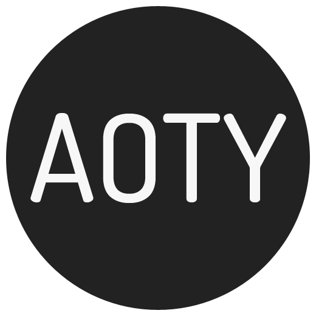

# aoty-sam

Sam's Album of the Year + helper tools



(logo via https://en.wikipedia.org/wiki/Album_of_the_Year_(website))

I'll likely revisit this lib every December...

# Files

All AOTY results are in the format `YYYY.txt`.

All Spotify playlists for a given year can be found in `YYYY-all.txt`.

All Spotify playlists in my account can be found at [all.txt](https://github.com/loisaidasam/aoty-sam/blob/master/all.txt).

# Tools

## Requirements

```
$ pip install -r requirements.txt
```

## .env

Copy [.env-example](https://github.com/loisaidasam/aoty-sam/blob/master/.env-example) into your own `.env`

```
$ cp .env-example .env
```

and fill it in with your own details (everything except `spotify_access_token`).

Source those variables:

```
$ set -a
$ source .env
```

## Access token

Run [gettoken.py](https://github.com/loisaidasam/aoty-sam/blob/master/gettoken.py) to get your access token, for example:

```
python gettoken.py
```

Follow the prompts, and then copy the resulting access token into your `.env` file

## Playlists

To dump all current spotify playlist names, first re-source your `.env` file:

```
$ set -a
$ source .env
```

Then run [getplaylists.py](https://github.com/loisaidasam/aoty-sam/blob/master/getplaylists.py) to dump all current playlists, for example:

```
$ python getplaylists.py > 2018-all.txt
```
